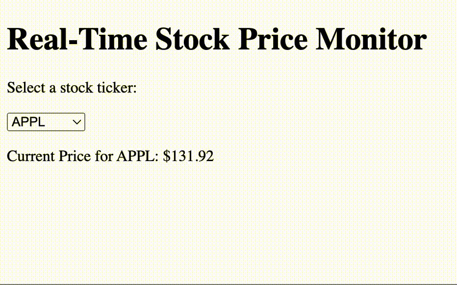

# stock_monitor

A fictitious real-time stock price monitor using [Mojolicious](https://www.mojolicious.org/), a modern web framework for [Perl](https://www.perl.org/).

# running it

```
$ morbo script/stock_monitor 
```

